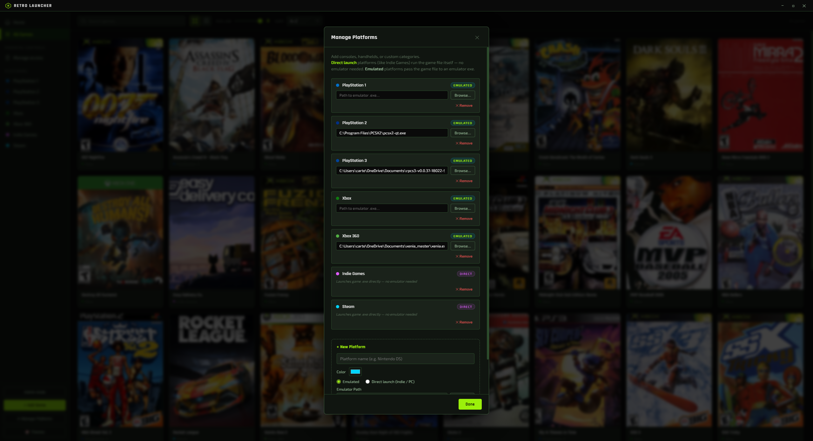
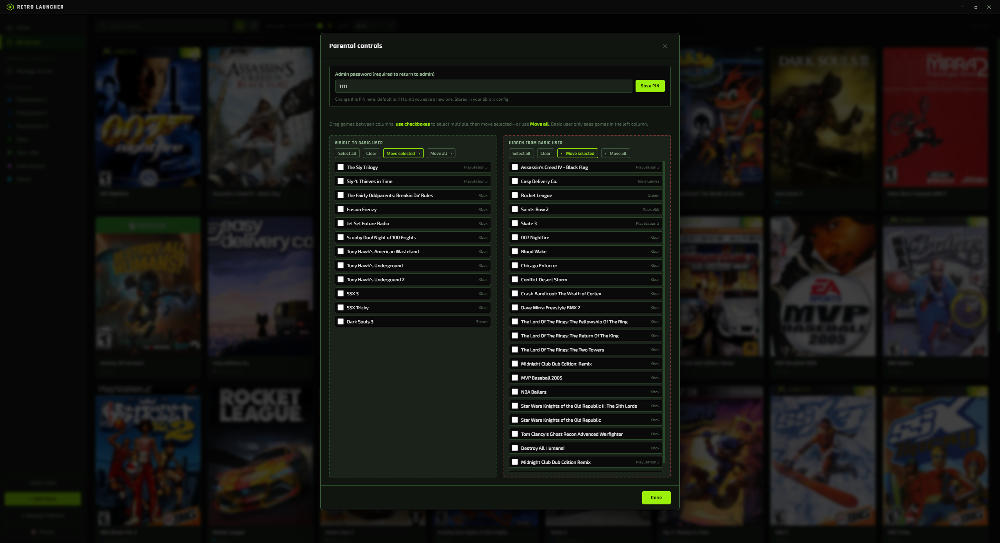
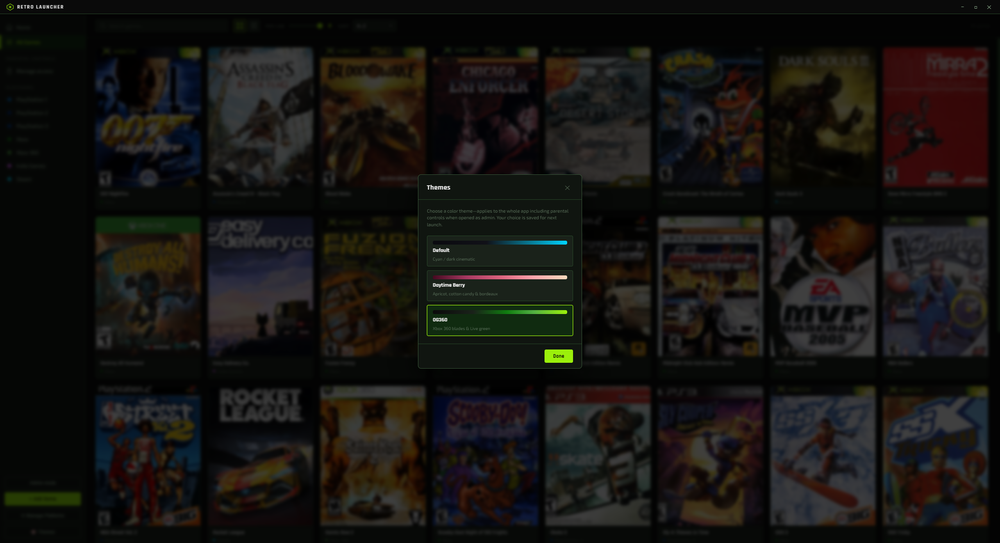

# Retro Launcher

[](https://www.electronjs.org/)
[](https://www.electronjs.org/)
[](https://nodejs.org/)

Retro Launcher is a local desktop game launcher for retro and PC games. It lets you organize and launch titles for **PS1, PS2, PS3, Xbox, Xbox 360**, and **Indie/Steam** from one interface, with cover art, play-time tracking, and optional parental controls.

The app is built with **Electron** (main process + preload bridge) and a **vanilla HTML/CSS/JS** renderer — no front-end framework. Config lives in `games.json`; themes and user mode use `localStorage`. Build the standalone `.exe` with the included batch file or `npm run build`.

TO INSTALL: Run the **BATCH file** (BUILD_ME_FIRST) on your computer and type "Retro Launcher" in the windows search bar. The app should pull up.


---

**Notable Features**
- Support for all emulators and platforms
- Parental controls to allow usage with children and kids
- Xbox/Playstation controller support (control the launcher via a controller)
- UI Themes

**Adding Games to your Library**

Click Add Game to open the game interace. 
- Add a title
- Choose the platform
- Select the game file path (usually a .iso / disc image file) # ORGANIZE YOUR GAME LIBRARY TO MAKE THIS PART EASY
- Select artwork (find these online and download them into 'retro-launcher-v3\retro-launcher\artwork\{PS1,PS2,PS3,XBOX,XBOX360}'


**Manage Platforms / Emulators**

Add as many emulators / game launchers as you want! Emulators require a path to a .exe file to launch the game. Platforms such as steam just need the game executable that steam uses to launch the game!



**Parental Controls**

The launcher comes with an admin-mode and basic-mode. In the admin mode, users can control which games / platforms are accessible to the basic user. This can be used to create a "console" for your kids with access to the games you want them to play.

Add + Remove games via the Parental Controls interface. When in basic-mode, you cannot enter admin-mode without a password that is configurable here as well.



**Themes**

Choose from 3 distinct themes to switch up the UI!
- Default *(dark, cyan)*
- Daytime Berry *(light, apricot)*
- OG360 *(based on Xbox360 menu colors)*



---

## Installation

Run the BATCH file on your computer and type "Retro Launcher" in the windows search bar. The app should pull up.

**Prerequisites:** [Node.js](https://nodejs.org/) v18 or later (npm included).

Clone the repo and install dependencies:

```bash
git clone https://github.com/YOUR_USERNAME/retro-launcher-v3.git
cd retro-launcher-v3/retro-launcher
npm install
```

Run the app in development:

```bash
npm start
```

To produce a distributable Windows executable, use the project’s batch file or:

```bash
npm run build
```

Output is in `dist/` (installer) or use `npm run build-portable` for a single portable `.exe`.

---

### Building the standalone .exe

From the `retro-launcher` folder:

```bash
npm install
npm run build
```

Or run **BUILD_ME_FIRST.bat** for a one-click build. The built app is in `dist/`. Replace `assets/icon.ico` with your own `.ico` if you want a custom icon.

### games.json

The app manages this file automatically. Manual edit is optional; structure looks like:

```json
{
  "games": [
    {
      "id": "abc123",
      "title": "Gran Turismo 4",
      "console": "PS2",
      "path": "C:\\\\Games\\\\PS2\\\\Gran Turismo 4.iso",
      "args": "",
      "artwork": "gran_turismo_4.jpg"
    }
  ],
  "emulators": {
    "PS1": "C:\\\\Emulators\\\\DuckStation\\\\duckstation-qt.exe",
    "PS2": "C:\\\\Emulators\\\\PCSX2\\\\pcsx2-qt.exe"
  }
}
```

---

## Tips

- **RPCS3 (PS3):** Use the path to `EBOOT.BIN` inside the game folder.
- **Xenia (Xbox 360):** Point to `.xex` or `.iso`; some titles need `--gpu=vulkan` in extra args.
- **xemu (Xbox):** Point to the game `.iso`; configure the Xbox HDD image in xemu first.
- **DuckStation / PCSX2:** Usually work with ISO or BIN/CUE paths and no extra args.

---

## License

Open-source. Use and modify as you like. If you share a fork, show me what you create with it!
